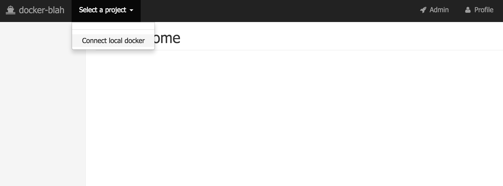
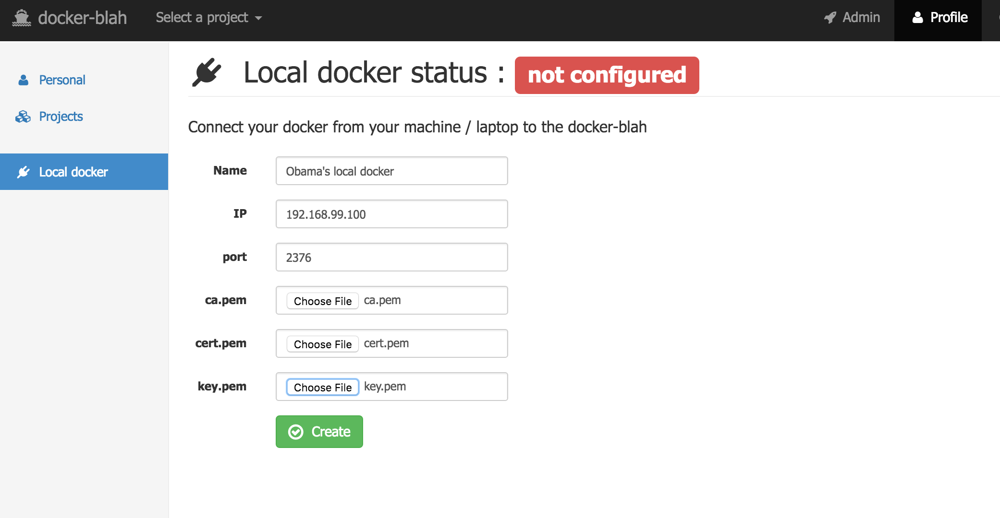
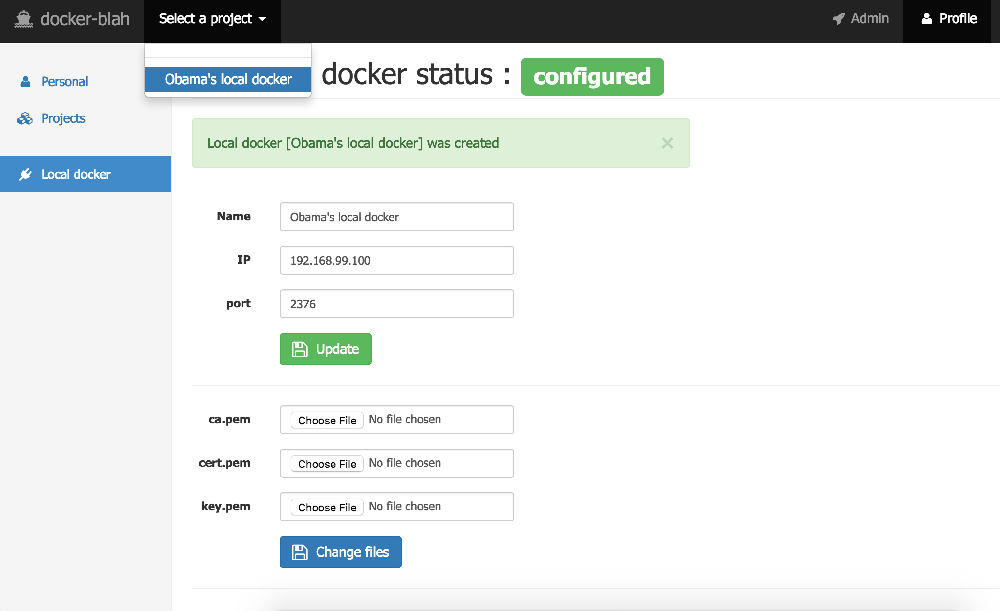
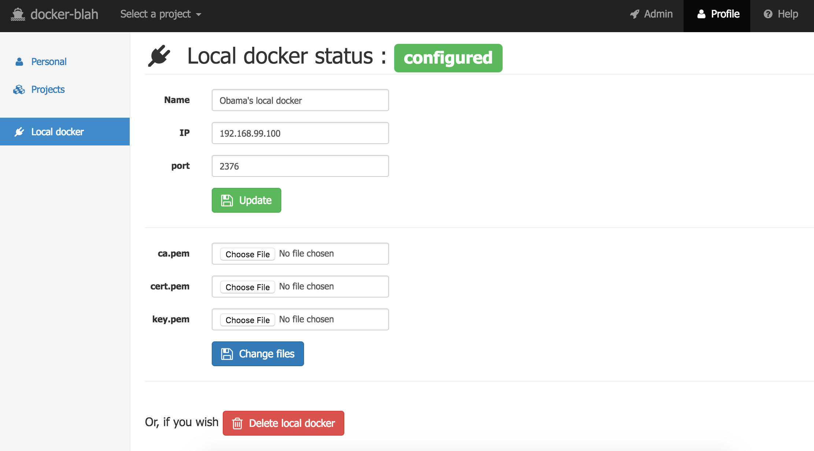

# docker-blah

Docker - be less as hossible

**Table of contents**

 * [About](#about)
   * [Technical specifications](#technical_specifications)
   * [Docker structure](#docker_structure)
 * [How to run](#how_to_run)
   * [Development](#how_to_run_development)
   * [Production](#how_to_run_production)
   * [Create certificates](#create_certificates)
   * [Configure docker daemon](#configure_docker_daemon)
 * [Usage](#usage)
   * [Connect local docker](#connect_local_docker)   
     * [Development](#connect_local_docker_development)
     * [Production](#connect_local_docker_production)   
 * [Who uses docker-blah](#who_uses_docker_blah)
 * [License](#license)
 
<a name="about"></a>
## About

`docker-blah` is a small project written in nodejs. It is a good "first choice" solution if you are doing just first steps with docker and don't want to setup whole infrastructure, like swarm, for example. Basic functionality are:

-   Create projects and add current nodes with docker daemon to a project
 
-   Define users, assign roles in projects
 
-   View/Start/Stop/Delete containers

-   View/Delete images

-   See container's statistics

-   See (stream in a real-time) cointaner's log, define custom logs per/project

-   Run commands in a container in attached/detached mode and stream output


This project will also provide you [nice GUI](#how_to_run_development) to your local docker daemon

<a name="technical_specifications"></a>
### Technical specifications

| What       | Why / How ? |
| ---------- | ---- |
| [the Docker](https://www.docker.com/) | ! |
| [phusion/baseimage:0.9.18](https://github.com/phusion/baseimage-docker/tree/rel-0.9.18) | perfect image |
| [runit](http://smarden.org/runit/) | as a part of the baseimage, to keep the node up and running |
| [nginx](https://www.nginx.com/) | serve for the static content |
| [nodejs 6.x](https://nodejs.org/en/) | all packages are installed in the docker-blah base image |
| [express 4](http://expressjs.com/) | perfect framework |
| [dockerode](https://github.com/apocas/dockerode) | talk to docker daemon |
| [sqlite3](https://github.com/mapbox/node-sqlite3) | database |
| [nunjucks 2](https://mozilla.github.io/nunjucks/) | template engine |
| [connect-redis](https://www.npmjs.com/package/connect-redis) | session backend |
| [winston](https://github.com/winstonjs/winston) | logger |
| [multer](https://github.com/expressjs/multer) | file uploader |
| [socket.io 1.x](http://socket.io/) | websockets, to stream logs & execute commands |
| [passport.socketio](https://github.com/jfromaniello/passport.socketio) | websocket auth |
| [and more...](./docker/base/build/node.sh) | |

<a name="docker_structure"></a>
### Docker structure

There is the separate [documentation](./docker/README.md)

<a name="how_to_run"></a>
## How to run

-   Default username/password are `changeme`/`changeme`. Don't forget to change!

-   Use `[sudo] sv restart <service_name>` to restart a service, like `nginx` or `docker-blah` itself.

-   Logs are in `/var/log/docker-blah/`:
    -   `run`: nodejs output & error log
    
    -   `system.log`: main log
    
    -   `nginx_error.log`: nginx error log
    
    -   `nginx_access.log`: nginx access log

<a name="how_to_run_development"></a>
### Development
1.  Checkout from git.

2.  Run a container:
    ```bash
    docker run -d -it -p $HTTP_PORT:80 -p $SSH_PORT:22 \
        -v $PATH_TO_SOURCES:/var/www/docker-blah/master \
        --name docker-blah-development \
        amberovsky/docker-blah-development
    ```
    
3.  Access in abrowser via `http://IP:$HTTP_PORT` or via shell `ssh www-data@IP -p $SSH_PORT`

4.  Next, read [how to connect your local docker in a development environment](#connect_local_docker_development).

<a name="how_to_run_production"></a>
### Production

**First, we need to configure docker daemon to listen to a port, so we need certificates to make it secure**

<a name="create_certificates"></a>
### 1. Create certificates

This topic is described in details in the [official docker docs](https://docs.docker.com/engine/security/https/)

The idea is to control all nodes in each project by one set of certificates, per project. So it will be easy to add/remove nodes from a project.

#### 2. Client/CA certificates 

1.  CA private key: 
    ```bash
    openssl genrsa -aes256 -out ca-key.pem 4096
    ```
    
2.  CA public key (You can use either IP or DNS in "Common Name"):
    ```bash
    openssl req -new -x509 -days 365 -key ca-key.pem -sha256 -out ca.pem
    ```

3.  Client key:
    ```bash
    openssl genrsa -out key.pem 4096
    ```
    
4.  Certificate signing request:
    ```bash
    openssl req -subj '/CN=client' -new -key key.pem -out client.csr
    ```
    
5.  Extensions config file:
    ```bash
    echo extendedKeyUsage = clientAuth > extfile.cnf
    ```
    
6.  Sign the public key:
    ```bash
    openssl x509 -req -days 365 -sha256 -in client.csr -CA ca.pem -CAkey ca-key.pem \
        -CAcreateserial -out cert.pem -extfile extfile.cnf
    ```
       
7.  Remove certificate signing request:
    ```bash
    rm -v client.csr
    ```

8.  Restrict access for keys:
    ```bash
    chmod -v 0400 ca-key.pem key.pem
    ```
    
9.  Restrict access for certificates:
    ```bash
     chmod -v 0444 ca.pem cert.pem
    ```
    
You will need `cert.pem`, `ca.pem` and `key.pem` in a project configuration in the `docker-blah`. Also, these files are required to generate server certificates.
     
#### 3. Server certificate (per each node / IP)
     
1.  Private key:
    ```bash
    openssl genrsa -out server-key.pem 4096
    ```
    
2.  Certificate signing request (remember, `$HOST` is the node's IP or DNS name):
    ```bash
    openssl req -subj "/CN=$HOST" -sha256 -new -key server-key.pem -out server.csr
    ```

3.  Allow connection using IP/DNS:
    ```bash
    echo subjectAltName = $HOST > extfile.cnf
    ```

4.  Signing the public key:
    ```bash
    openssl x509 -req -days 365 -sha256 -in server.csr -CA ca.pem -CAkey ca-key.pem \
      -CAcreateserial -out server-cert.pem -extfile extfile.cnf
    ```
    
5.  Remove certificate signing request:
    ```bash
    rm -v server.csr
    ```
    
6.  Restrict access for key:
    ```bash
    chmod -v 0400 server-key.pem
    ```
    
7.  Restrict access for certificate:
    ```bash
     chmod -v 0444 server-cert.pem
    ```

<a name="configure_docker_daemon"></a>
### 4. Configure docker daemon:

Now we need to tell docker daemon to listen on a particular port using TLS. Locate your docker configuration files (probably `/etc/sysconfig/docker` or `/etc/docker`

1.  Let's create folder for docker certificates
    ```bash
    mkdir -p /etc/docker/ssl
    ```
    
2.  Move server files:
    ```bash
    mv ./server-key.pem /etc/docker/ssl/server-key.pem
    mv ./server-cert.pem /etc/docker/ssl/server-cert.pem
    ```
    
3.  Copy CA key:
    ```bash
    cp ./ca.pem /etc/docker/ssl/ca.pem
    ```

4.  Check access permissions for certificates!

5.  Edit docker startup parameters, change $PORT and $IP. (Note we bind also to unix socket to make life a bit easier using local client):
    ```bash
    other_args="-H=$IP:$PORT --tlsverify --tlscacert=/etc/docker/ssl/ca.pem --tlscert=/etc/docker/ssl/server-cert.pem --tlskey=/etc/docker/ssl/server-key.pem -H unix:///var/run/docker.sock"
    ```
    
6.  Restart the docker daemon.

7.  You might need to change iptables, but not always:
    ```bash
    iptables -I INPUT -p tcp --dport 81 -j ACCEPT
    ```

8.  Test connection on your local machine:
    ```bash
    docker --tlsverify --tlscacert=./ca.pem --tlscert=./cert.pem --tlskey=./key.pem -H tcp://$HOST:$PORT version
    ```
    
<a name="run_docker_blah"></a>    
#### 5. Run docker-blah
    
-   We need two folders - one for configuration file and one for sqlite3 database. Let's say you've decided to use `/var/www/docker-blah/` folder (don't forget to get proper permissions!):
    ```bash
    mkdir -p /var/www/docker-blah/data /var/www/docker-blah/config
    ```

-   Create `config.json` in the `/var/www/docker-blah/config`:
    ```json
    {
      "session": {
          "secret": "hiding ninja",
          "store_secret": "more hiding ninja",
          "key": "express.sid"
      },
    
      "redis": {
          "host": "10.20.30.40",
          "port": "6379"
      },
    
      "noCache": true
    }
    ```
    
    Change sessions `secret`/`store_secret` params for security reasons, `key` is not so important.
    
-   If you already have a `redis` instance somewhere in your network:
    1.  Change `redis` host/port respectively.
    2.  Run `docker-blah`:
    
        ```bash
        sudo docker run -d -it --name docker-blah \
            -p $PORT:80 \
            -v /var/www/docker-blah/config/:/var/www/docker-blah/master/config \
            -v /var/www/docker-blah/data/:/var/www/docker-blah/data \
            amberovsky/docker-blah-production
        ```

-   Or, if you want to run redis on the same host:
    1.  Run redis instance:
        ```bash
        sudo docker run -d --name=docker-blah-redis redis
        ```
    
    2.  Change redis name in the `/var/www/docker-blah/config/config.json` to the `redis`
    
    3.  Run `docker-bla` with linked `redis` container:
        ```bash
        sudo docker run -d -it --name docker-blah \
            -p $PORT:80 \
            -v /var/www/docker-blah/config/:/var/www/docker-blah/master/config \
            -v /var/www/docker-blah/data/:/var/www/docker-blah/data \
            --link docker-blah-redis:redis \
            amberovsky/docker-blah-production
        ```

<a name="usage"></a>
## Usage

Explained in details (except local docker) [here](/docs/usage/README.md)

<a name="connect_local_docker"></a>
### Connect local docker daemon:

One of use cases of `docker-blah` is to treat your local docker daemon as a separate node and thus to have nice GUI. Any member of your team can connect its local docker to your team's `docker-blah` instance.
<a name="connect_local_docker_development"></a>
#### Development:

If you are using `docker-blah` only for testing purposes (only on your local machine), then this is how you can connect your local docker (OS X):

1.  You need to know your docker-machine ip and port. Run in your shell:
    ```bash
    docker-machine env default
    ```

2.  Open `docker-blah`, click *Select a project* -> *Connect local docker*:
    

3.  You need to provide name, ip, port and certificates. `docker-machine` did them for you. Click *Choose file*, then press *CMD + SHIT + .* to see hidden files and folders in the finder. Navigate to the `/Users/$username/.docker/machine/machines/default/` and choose `ca.pem`, `cert.pem` and `key.pem` separately:
    
    
4.  Click *Create*!
    

5.  Now you can use your local docker as a standalone node. Click *Select a project* -> *Obama's local docker*:
    

6.  At any time you can delete or change your local docker parameters. Click *Profile* in the top navigation bar, then *Local docker* in the left panel: 
    

<a name="connect_local_docker_production"></a>
#### Production:

To be done.

<a name="who_uses_docker_blah"></a>
## Who uses docker-blah

 * [Collinson Group](http://collinsongroup.com/)
 
Please let me know if you are using `docker-blah`!
 
<a name="license"></a>
## License

`docker-blah` is [Apache 2.0 licensed](./LICENSE)

Copyright (C) 2016 Anton Zagorskii aka amberovsky.
All rights reserved. Contacts: <amberovsky@gmail.com> 
