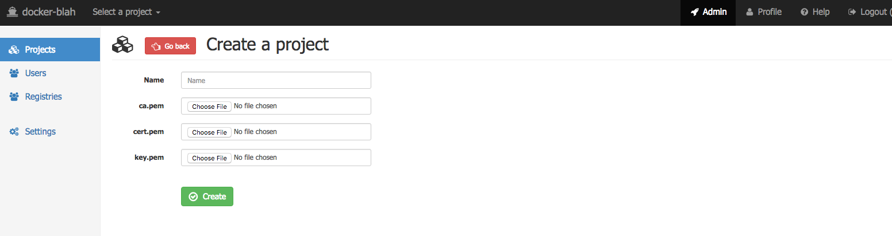

# `docker-blah` admin guide

[Go back to the main guide doc](../README.md)

You will have admin rights only if you have **SUPER**/**ADMIN** role. 

## Projects

-   Click *admin* in the top navigation bar, then *Projects* in the left panel
    

-   Click *Create new* button to create a new project
    
    
    Provide a **unique** name across all projects and certificates for all nodes in the new project. Read [main documentation](/README.md#create_certificates) about certificates.
    
-   *Edit* and *Delete* buttons have no caveats

-   *Users* (list all users in a project), *Nodes* (list all nodes in an project) and *Settings* (show settings for this project) are just shortcuts to other pages.

## Users

-   Click *admin* in the top navigation bar, then *Users* in the left panel
    
    
    You can filter by *System role* or *Project* or *Project role*.

-   Click *Create new* button to create a new user
    
    
    *System role* (not in project) can be:
    1.  **SUPER** - owner of the `docker-blah`, only another **SUPER** user can change **SUPER** user
    2.  **ADMIN** - admin, has access to all projects and users, can create/edit/delete users and projects
    3.  **USER** - normal user, only has access to a particular project
    
    *Role* per project can be:
    1.  **ADMIN** - admin, can add/edit/delete nodes in the project
    2.  **USER** - normal user, only can see the list of running containers, inspect, run commands inside a container
    3.  **NONE** - (default) does not have access to the project

## Registries

-   Click *admin* in the top navigation bar, then *Registries* in the left panel
    

-   Work in progress

## Settings

-   Click *admin* in the top navigation bar, then *Settings* in the left panel
    

-   Nothing here for now

## License

`docker-blah` is [Apache 2.0 licensed](../LICENSE)

Copyright (C) 2016 Anton Zagorskii aka amberovsky.
All rights reserved. Contacts: <amberovsky@gmail.com> 