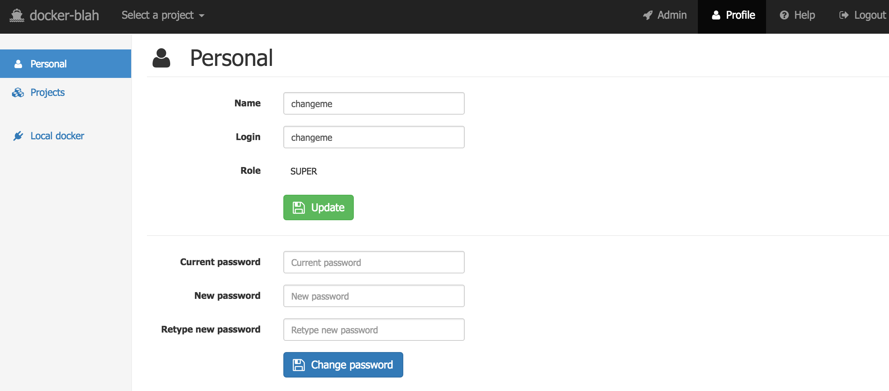
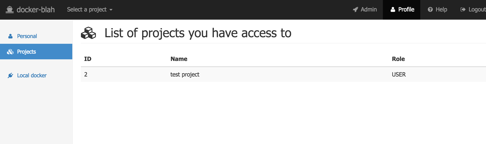
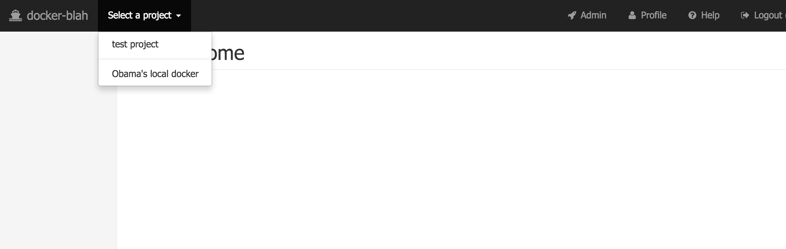
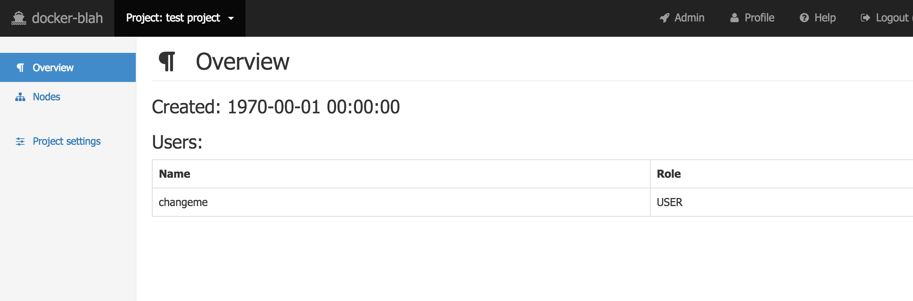
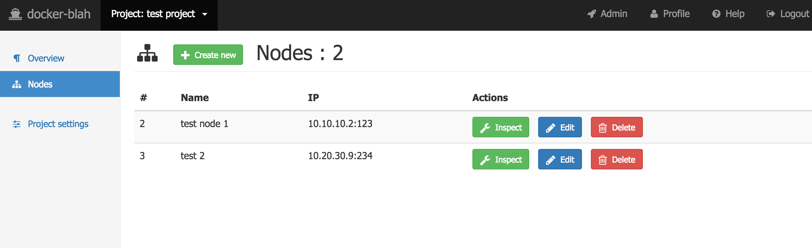
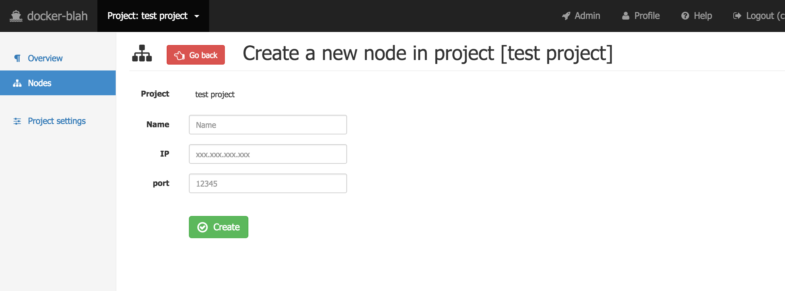
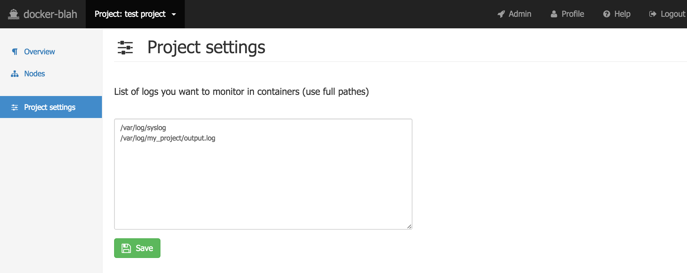

# `docker-blah` user guide

[Go back to the main guide doc](../README.md)

**Table of contents**

 * [Profile](#profile)
   * [Personal](#profile_personal)
   * [Projects](#profile_projects)
   * [Local docker](#profile_local_docker)   
 * [Projects](#projects)
   * [Overview](#project_overview)
   * [Project: nodes](#project_nodes)   
   * [Project settings](#project_settings)
 * [License](#license)

## Profile

Profile is a place where you can change you personal data and configure local docker

### Personal

-   Click *Profile* in the top navigation bar, then *Personal* in the left panel
    
    
-   Change you name or login, then click the *Update* button

-   Change you password, then click the *Change password* button

-   Check [admin guide](/docs/usage/admin/README.md#users) to understand your *System role*

### Projects

-   Click *Profile* in the top navigation bar, then *Projects* in the left panel
    
    
-   You will see list of projects you have access to

-   Check [admin guide](/docs/usage/admin/README.md#users) to understand your *Project role*

### Local docker

Local docker is a way to manage you local docker daemon as a separate node with nice GUI and full capabilities.

Please read main documentation about [local docker](/README.md#connect_local_docker)

## Projects

Projects is a heart of the `docker-blah`. Click *Select a project* in the top navigation bar. You will see a list, separated into two groups. The first one - is the list of projects you have access to. The second one - is your local docker. `docker-blah` will offer you to configure local docker, if it is not confured yet. Otherwise, you can click on it and treat it as a separate project.

  

### Overview

-   *Select a project* in the top navigation bar, then *Overview* in the left panel
    
    
    Just a list of users in the project
    

### Nodes

-   *Select a project* in the top navigation bar, then *Nodes* in the left panel
    
    
    You will see a list of nodes in the project. You can edit or add a new one, if you have *ADMIN* role in this project
    
-   Click *Inspect* to dive in the node. Please read dedicated [documentation](/docs/usage/user/nodes/README.md) about *Inspect*

-   Click *Create new* to create a new node in this project
    
    
    Provide a name, an IP and a port for the new node. You have to be sure, that you've [configured docker daemon](/README.md#how_to_run_production) to accept TLS connection on that IP:port

### Project settings

-   *Select a project* in the top navigation bar, then *Project settings* in the left panel
    
    
-   You can configure list of logs, one per line. Later, you will be able to quick watch logs in realtime in the [container: custom logs TODO LINK HERE]()

## License

`docker-blah` is [Apache 2.0 licensed](/LICENSE)

Copyright (C) 2016 Anton Zagorskii aka amberovsky.
All rights reserved. Contacts: <amberovsky@gmail.com> 
