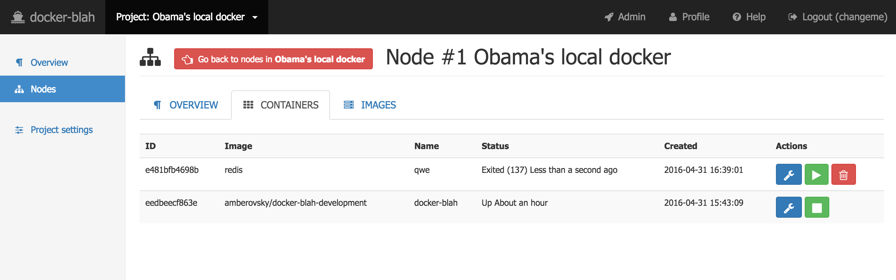

# `docker-blah` user guide for node's *Inspect*

[Go back to the main usage guide documentation](/docs/usage/user/README.md#project_nodes)

In this documentation I'll use my local docker as an example. I assume you've already clicked *Inspect* button on a selected node.

**Table of contents**

 * [Overview](#overview)
 * [Containers](#containers)
   * [Inspect](#containers_inspect)
 * [Images](#images)   
 * [License](#license)

## Overview
Click *OVERVIEW* in the tab list

Just a brief info about a docker daemon at the node.

## Containers
Click *CONTAINERS* in the tab list

You will see a list of containers. You can start/stop/delete a container. `docker-blah` will not allow you to delete a running container

### Inspect

Click *Inspect* to see container's details and run commands. Please read dedicated [documentation](/docs/usage/user/nodes/containers/README.md) about *Inspect*

## Images
Click *IMAGES* in the tab list

You will see a list of images. You can delete a particular image. `docker-blah` will not allow you to delete an image, if there is a running container from that image

## License

`docker-blah` is [Apache 2.0 licensed](/LICENSE)

Copyright (C) 2016 Anton Zagorskii aka amberovsky.
All rights reserved. Contacts: <amberovsky@gmail.com> 