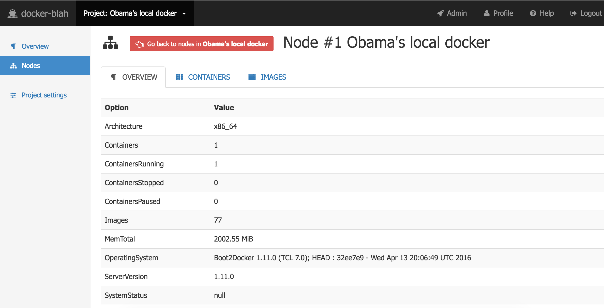
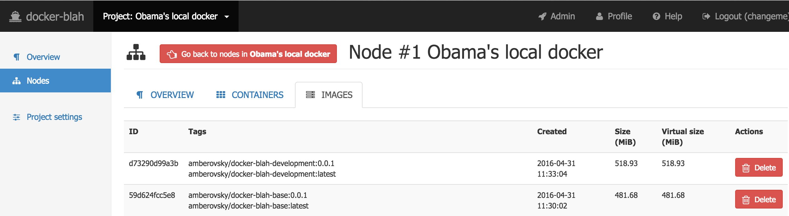

# `docker-blah` user guide for nodes *Inspect*

[Go back to the main usage guide doc](../README.md)

In this documentation I'll use my local docker as an example. I assume you've already clicked *Inspect* button on a selected node.

**Table of contents**

 * [Overview](#overview)
   * [Personal](#profile_personal)
   * [Projects](#profile_projects)
   * [Local docker](#profile_local_docker)   
 * [Containers](#containers)
   * [Overview](#project_overview)
   * [Project: nodes](#project_nodes)   
   * [Project settings](#project_settings)
 * [Images](#images)   
 * [License](#license)

## Overview
Click *Overview* in the tab list

Just a brief info about a docker daemon at the node.

## Images
Click *Images* in the tab list

You will see a list of images. You can delete a particular image. `docker-blah` will not allow you to delete an image, if there is a running container from that image

## License

`docker-blah` is [Apache 2.0 licensed](/LICENSE)

Copyright (C) 2016 Anton Zagorskii aka amberovsky.
All rights reserved. Contacts: <amberovsky@gmail.com> 