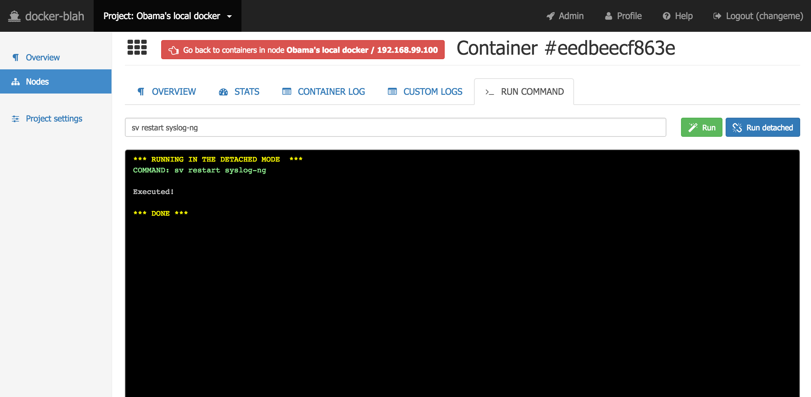

# `docker-blah` user guide for container's *Inspect*

[Go back to the main node usage guide doc](../README.md)

In this documentation I'll use my local docker as an example. I assume you've already clicked *Inspect* button on a selected container in a selected node.

You can see only *CONTAINER LOG*, if a container is **stopped**

**Table of contents**

 * [Overview](#overview)
 * [Stats](#stats)
 * [Container log](#container_log)   
 * [Custom logs](#custom_logs)
 * [Run command](#run_command)  
 * [License](#license)

## Overview

-   Click *OVERVIEW* in the tab list
    

-   Useful information, like
    -   Base info (Command, IP, etc...)
    -   Mounted volumes
    -   Open ports
    -   List of processes

## Stats

-   Click *STATS* in the tab list
    

-   *STATS* provide you memory, CPU, block IO and network usage in a real-time

## Container log

-   Click *CONTAINER LOG* in the tab list
    

-   *CONTAINER LOG* is a equivalent for `docker logs --follow` command, in a real-time

## Custom logs

-   Click *CUSTOM LOGS* in the tab list
    

-   *CUSTOM LOGS* is a equivalent for `tail -f $LOG` command, in a real-time

-   To define a list of custom logs, see [project settings](/docs/usage/user/README.md#project_settings)

-   At any time you can switch between logs, just click on a different log name

-   To stop watching the log - click on a *STOP* button

## Run command

-   Click *RUN COMMAND* in the tab list
    

-   You can run a command in a two ways (bear in mind the command will be exexuted under the **root** user!):
    -   Run (attached)
        -   Mostly it is equivalent for `docker exec -it $ID $COMMAND`
        -   `STDIN`, `STDERR`, `STDOUT` are attached, however, you don't have an interactive shell (for now)
        -   Running commands like `cat /var/log/syslog` is equivalent to run them in the detached mode
        -   You can either kill (send CTRL-C) or detach (equivalent to send CTRL-P + CTRL-Q in `docker exec`) the command
            
    -   Run detached
        -   Mostly it is equivalent for `docker exec -d $ID $COMMAND`
        -   Useful to run background tasks or restart a service
        -   You will not have any output
            

## License

`docker-blah` is [Apache 2.0 licensed](/LICENSE)

Copyright (C) 2016 Anton Zagorskii aka amberovsky.
All rights reserved. Contacts: <amberovsky@gmail.com> 
